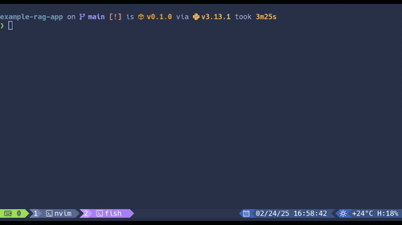
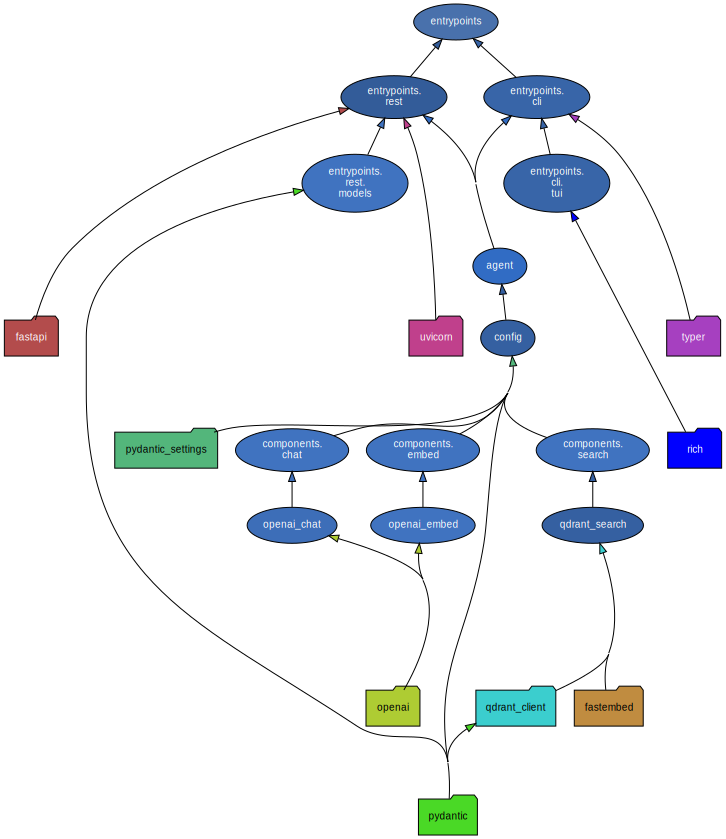

# ⚡🤖 Example RAG Application

<div align="center">
  
  <p><em>RAG with Groq Llama-3.3-70b using the CLI entrypoint</em></p>
</div>

This repository contains a Python program that
exposes a RAG pipeline through a REST API or interactive CLI.
It is designed to serve as a reference implementation
for AI applications that follow best practices.

Importantly, **this repository does not use any LLM framework!** It works
directly with the OpenAI API, which gives us more flexibility and control.
I believe this is the best way to learn how to work with LLMs for app building;
Of course, you can add a framework if you prefer.

It includes the following:

- 🏎️ **FastAPI** – A type-safe, asynchronous web framework for building REST APIs.
- 💻 **Typer** – A framework for building command-line interfaces.
- 🍓 **LiteLLM** – A proxy to call 100+ LLM providers from the OpenAI library.
- 🔌 **Langfuse** – An LLM observability platform to monitor your agents.
- 🔍 **Qdrant** – A vector database for semantic, keyword, and hybrid search.
- ⚙️ **Pydantic-Settings** – Configures the application using environment variables.
- 🚚 **UV** – A project and dependency manager.
- 🏍️ **Redis** – An in-memory database for semantic caching.
- 🧹 **Ruff** – A linter and formatter.
- ✅ **Mypy** – A static type checker.
- 📍 **Pydeps** – A dependency graph generator.
- 🧪 **Pytest** – A testing framework.
- 🏗 **Testcontainers** – A tool to set up integration tests.
- 📏 **Coverage** – A code coverage tool.
- 🗒️ **Marimo** – A next-gen notebook/scripting tool.
- 👟 **Just** – A task runner.
- 🐳 **Docker** – A tool to containerize the Python application.
- 🐙 **Compose** – A container orchestration tool for managing the application infrastructure.

## Requirements

There are only two requirements to run this project:

- UV ([install](https://docs.astral.sh/uv/getting-started/installation/))
- Docker ([install](https://docs.docker.com/get-docker/))

## Usage

### Installation

Every command you need to run this repository is available in the `Justfile`.
The `Justfile` contains recipes that can be run with the `just` CLI.

I recommend you install `just` as a tool via `uv`:

```bash
uv tool install just
```

Otherwise, you can install it along with all other application dependencies with:

```bash
uv sync --dev
```

### Running the Application

#### 1. Setting up the infrastructure

Before running the application, you need to set up the environment variables.

Make a copy of the `.env.example` file and name it as `.env`.
Put your API keys and other environment variables in your `.env` file.
You don't need to supply all the listed variables, only the ones you want to use.

Once we have our `.env` file, we can set up our infrastructure with one command:

```bash
just scaffold
```

This will use `docker compose` to run microservice containers in the background.

#### 2. Setting up LLM Observability

Once the infrastructure is up and running, you can go to port `3000` on your machine
where the Langfuse web interface is running.

This microservice is running completely locally; You can create an account with
a fake email address if you wish.

Once you have an account, you can create a project and get your private and public
API keys.You can the place these keys in your `.env` file to automatically log all
calls from the LiteLLM proxy to Langfuse.

You might need to restart your infrastructure containers to apply the new environment
variables. Luckily, that is easy to do with these commands:

```bash
just teardown # This will stop all infrastructure containers

just scaffold # This will start all infrastructure containers again
```

#### 3. Creating a search index

For this example repository, I've included a basic RAG ingestion pipeline that reads
the Wikipedia dataset from Hugging Face, then chunks and filters the data, and finally
creates embeddings for each chunk, which are then indexed in Qdrant.

This pipeline is fairly simple. It's main purpose is to be easy to replicate
as a way to run the application. You can easily substitute it with your own pipeline.
The only requirement is that your Qdrant payloads include a `content` field.

You can run the ingestion pipeline with marimo using the following command:

```bash
just create-collection
```

Marimo is a next-gen notebook tool that allows you to create python notebooks that
double as scripts. Additionally, they use `uv` to define dependencies inline which
eliminates the need to manage python versions or virtual environments.

#### 4. Running the CLI

To run the application as an interactive CLI, use the following command:

```bash
uv run cli
```

By default, this will start a chat session with
a mock LLM which just echoes back your input.

To tall to a real LLM, you can use the `--model`
flag to specify the model you want to use.
`-m` acts as a shorthand for `--model`.
For example, to use the `gpt-4-turbo` model, you can run:

```bash
uv run cli -m gpt-4-turbo
```

You might notice that `gpt-4-turbo` is not a real model name for the OpenAI API.
However, as we are using LiteLLM as a proxy, we can use any model configured
in the  `infra/litellm/config.yml` file.

Just make sure you have supplied the proper environment
variables in your `.env` file for the model you want to use.

#### 5. Running the API

To run the application as a REST API, use the following command:

```bash
uv run api
```

By default, this will start a REST API server on port `8000`.
You can go to `http://localhost:8000/docs` to see the API documentation.

## Development

### Additional functionality

#### 6. Running the linter and formatter

This repository uses [Ruff](https://github.com/charliermarsh/ruff)
for linting and formatting.
You can run ruff as configured in the pyproject.toml by using the following command:

```bash
just tidy
```

#### 7. Running the type checker

This repository uses [Mypy](https://github.com/python/mypy) for type checking.
You can run mypy as configured in the pyproject.toml by using the following command:

```bash
just type-check
```

#### 8. Running the test suite

This repository uses [Pytest](https://github.com/pytest-dev/pytest) for testing.
It also includes:

- pytest-asyncio to run async tests.
- pytest-cov to generate coverage reports.
- pytest-sugar to add more useful output to your tests.
- testcontainers to set up test infrastructure.

Tests are divided into three categories:

- Unit tests: Tests that focus solely on the functionality of the code.
- Integration tests: Tests that focus on testing the code with real services.
- End-to-end tests: Tests that focus on testing the entire application stack.

You can run the test suite as configured in the pyproject.toml
by using the following command:

```bash
just test unit # This will run all unit tests

just test integration # This will run all integration tests

just test e2e # This will run all end-to-end tests

just test # This will run all tests
```

#### 9. Generating a dependency graph

Dependency graphs can be useful to make sure your application
does not become too coupled between different modules.

<div align="center">
  
  <p><em>The contact area of each package is reduced as much as possible.</em></p>
</div>

To generate a dependency graph, you can use the following command:

```bash
just graph
```

This will generate a dependency graph in the `dependency-graph.svg` file.
It should also automatically open the file in your default image viewer.

#### 10. Running local CI

A sample CI pipeline is included in this repository.
It runs the linter and formatter, followed by the type checker,
and finally the full test suite.
It is meant to simulate the steps your real CI should take
(Github Actions, Gitlab CI, etc.).

To run the CI pipeline, you can use the following command:

```bash
just ci
```

#### 11. Easier way to run the application

You can setup the application infrastructure and run the application
in a single command using the following command:

```bash
just run cli # To run the CLI

just run api # To run the API
```

Why not use this command to start? Because this command assumes that you already
have an existing collection in Qdrant. If it's the first time you're running
the application, it's best to follow the steps above.

But if you already have a collection, you can use the command directly.
